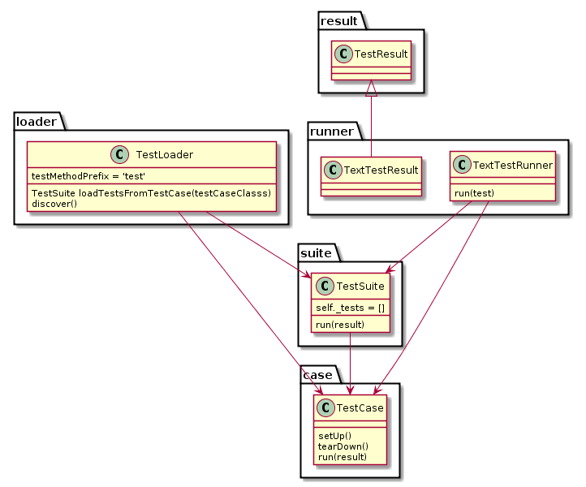

# Unittest

Python中单元测试框架。

python3官方文档： <https://docs.python.org/3/library/unittest.html>

主要有4个概念：

* test case
* test suite
* test runner
* test fixture

静态类图：<http://www.cnblogs.com/hackerain/p/3682019.html>



> - 一个TestCase的实例就是一个测试用例。什么是测试用例呢？就是一个完整的测试流程，包括测试前准备环境的搭建(setUp)，执行测试代码(run)，以及测试后环境的还原(tearDown)。元测试(unit test)的本质也就在这里，一个测试用例是一个完整的测试单元，通过运行这个测试单元，可以对某一个问题进行验证。
> - 而多个测试用例集合在一起，就是TestSuite，而且TestSuite也可以嵌套TestSuite。
> - TestLoader是用来加载TestCase到TestSuite中的，其中有几个loadTestsFrom__()方法，就是从各个地方寻找TestCase，创建它们的实例，然后add到TestSuite中，再返回一个TestSuite实例。
> - TextTestRunner是来执行测试用例的，其中的run(test)会执行TestSuite/TestCase中的run(result)方法。
> - 测试的结果会保存到TextTestResult实例中，包括运行了多少测试用例，成功了多少，失败了多少等信息。
>
> 这样整个流程就清楚了，首先是要写好TestCase，然后由TestLoader加载TestCase到TestSuite，然后由TextTestRunner来运行TestSuite，运行的结果保存在TextTestResult中，整个过程集成在unittest.main模块中。 

简单样例代码：<https://huilansame.github.io/huilansame.github.io/archivers/python-unittest>

```python
# -*- coding: utf-8 -*-

import unittest
from mathfunc import *


class TestMathFunc(unittest.TestCase):
    """Test mathfuc.py"""

    def test_add(self):
        """Test method add(a, b)"""
        self.assertEqual(3, add(1, 2))
        self.assertNotEqual(3, add(2, 2))

    def test_minus(self):
        """Test method minus(a, b)"""
        self.assertEqual(1, minus(3, 2))

    def test_multi(self):
        """Test method multi(a, b)"""
        self.assertEqual(6, multi(2, 3))

    def test_divide(self):
        """Test method divide(a, b)"""
        self.assertEqual(2, divide(6, 3))
        self.assertEqual(2.5, divide(5, 2))

if __name__ == '__main__':
    unittest.main()
```

执行结果：

```shell
.F..
======================================================================
FAIL: test_divide (__main__.TestMathFunc)
Test method divide(a, b)
----------------------------------------------------------------------
Traceback (most recent call last):
  File "D:/py/test_mathfunc.py", line 26, in test_divide
    self.assertEqual(2.5, divide(5, 2))
AssertionError: 2.5 != 2

----------------------------------------------------------------------
Ran 4 tests in 0.000s

FAILED (failures=1)
```

说明：

1. 在第一行给出了每一个用例执行的结果的标识，成功是 `.`，失败是 `F`，出错是 `E`，跳过是 `S`。从上面也可以看出，测试的执行跟方法的顺序没有关系，test_divide写在了第4个，但是却是第2个执行的。
2. 每个测试方法均以 `test` 开头，否则是不被unittest识别的。
3. 在unittest.main()中加 `verbosity` 参数可以控制输出的错误报告的详细程度，默认是 `1`，如果设为 `0`，则不输出每一用例的执行结果，即没有上面的结果中的第1行；如果设为 `2`，则输出详细的执行结果，

